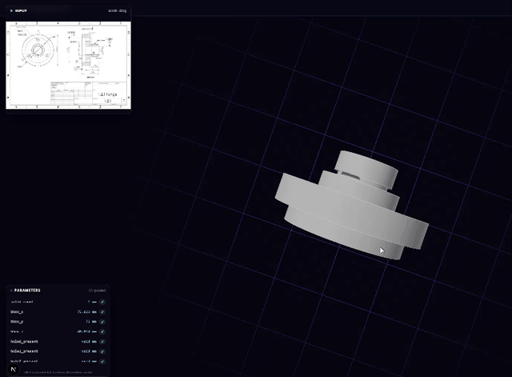
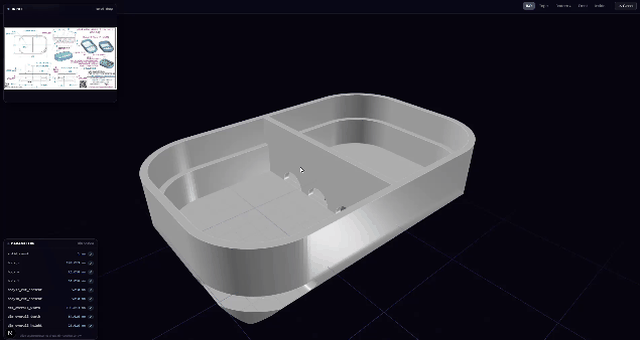
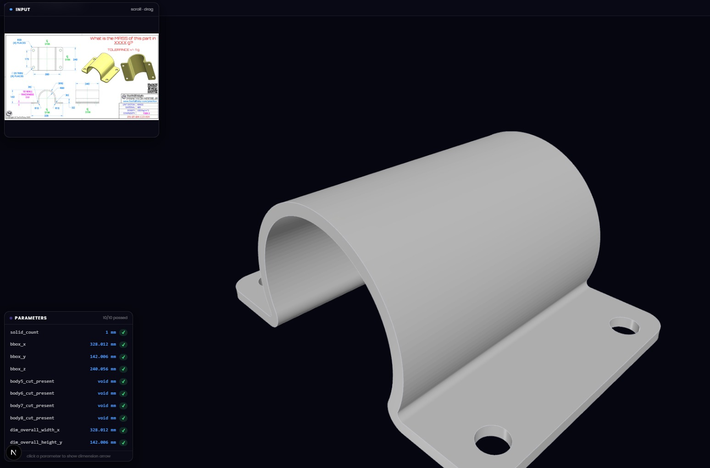
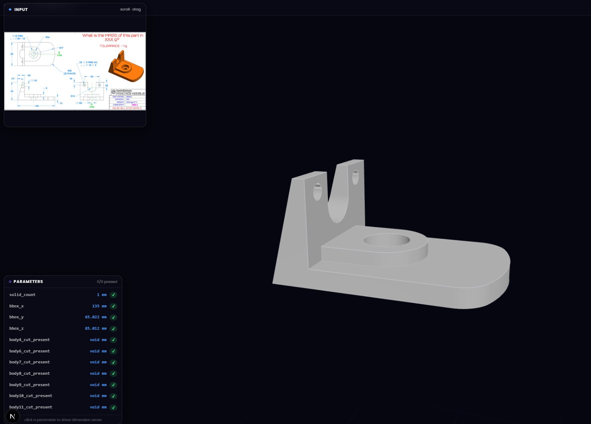
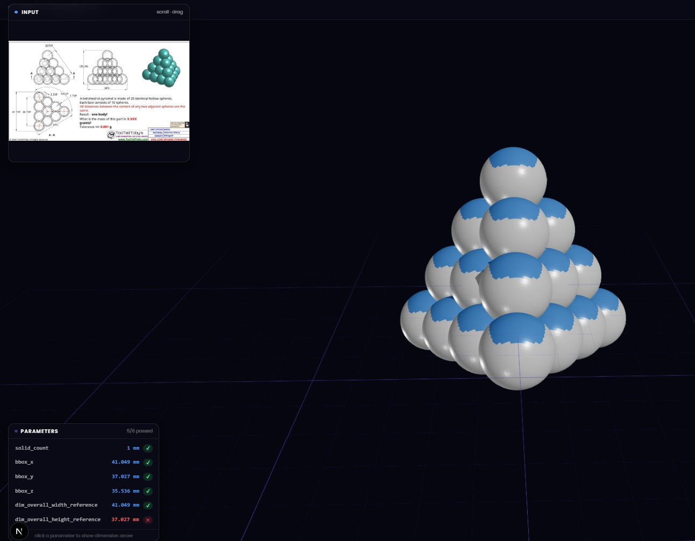

<div align="center">

# drawing2cad

**Convert a technical drawing into a parametric CAD model in seconds.**

Upload a PNG or JPG engineering drawing — get back an editable CadQuery script, a STEP file, an STL file, and a full validation report.


</div>

---

## Demo

<div align="center">

**Upload a drawing and watch the pipeline run**



**Explore the interactive 3D result**



</div>

---

## Gallery

<div align="center">

| Curved bracket clamp | Forked mount | Tetrahedral sphere array |
|:---:|:---:|:---:|
|  |  |  |
| 10/10 checks passed | 11/11 checks passed | 5/6 checks passed |

</div>

---

## How It Works

```
PNG/JPG drawing
  → vision LLM extraction
  → Pydantic PartSpec
  → sanity checks
  → deterministic CadQuery generation
  → STEP / STL export
  → dimensional validation
  → optional visual review and LLM repair
```

Each completed run writes four artifacts:

| File | Description |
|------|-------------|
| `partspec.json` | Exact specification used for generation |
| `part.py` | Editable CadQuery source with named parameters |
| `part.step` | B-rep CAD model (import into any CAD tool) |
| `part.stl` | Triangulated mesh for preview and slicing |

---

## Supported Geometry

Drawing2CAD handles a broad range of common mechanical features:

- **Solids** — extrusions, revolutions, swept profiles, lofts
- **Operations** — multi-body booleans, rounded boxes, cylinders, spheres
- **Features** — slots, holes, counterbores, pockets, notches, fillets
- **Parts** — plates, brackets, trays, stepped shafts, bent arms, forked mounts, machined components

> Freeform surfaces, variable lofts, and exact sheet-metal development are handled as approximation cases.

---

## Stack

| Layer | Technology |
|-------|-----------|
| CAD kernel | CadQuery |
| AI extraction | Google Gemini, OpenAI (via LangChain) |
| Backend | FastAPI + Uvicorn |
| Frontend | Next.js 16, React 19, Three.js |
| Schema | Pydantic |
| Tests | pytest |

---

## Setup

**1. Create a virtual environment**

```powershell
# Windows (PowerShell)
python -m venv .venv
.venv\Scripts\Activate.ps1
pip install -r requirements.txt
```

```bash
# macOS / Linux
python -m venv .venv
source .venv/bin/activate
pip install -r requirements.txt
```

**2. Install frontend dependencies**

```powershell
cd drawing2cad/frontend
npm install   # use npm.cmd on Windows if the shim doesn't resolve
cd ../..
```

**3. Set environment variables**

Create `drawing2cad/.env`:

```dotenv
GOOGLE_API_KEY=...
OPENAI_API_KEY=...   # needed for OpenAI model or OpenAI-backed workflow
TAVILY_API_KEY=...   # optional — powers research features
```

---

## Run the Web App

```powershell
# Terminal 1 — backend
python -m drawing2cad.server
# → http://localhost:5001

# Terminal 2 — frontend
cd drawing2cad/frontend
npm run dev
# → http://localhost:3000
```

The result page shows the source drawing, an interactive STL viewer, extracted parameters, dimensional checks, visual review, research tools, and editable CadQuery source — all in one place.

---

## Run From Python

```python
from drawing2cad.orchestrator import reconstruct

result = reconstruct(
    "tests/images/test_5.png",
    out_dir="out/test_5",
    validate=True,
)
print(result["score"], result["stop_reason"])
```

Run the deterministic model first, then let the LLM repair it if needed:

```powershell
python -m drawing2cad.llm_codegen tests/images/test_5.png
```

Generate CAD directly from an existing `PartSpec` JSON:

```powershell
python -m drawing2cad.cad_generator drawing2cad/outputs/test_5_corrected.json
```

---

## Batch Evaluation

```powershell
python -m drawing2cad.batch_run               # all PNGs under tests/images/
python -m drawing2cad.batch_run path/to/dir   # custom directory
```

Prints geometry type, validation score, attempt count, and stop reason for each drawing.

---

## Validation

**Layer 1 — Dimensional** checks the generated solid against `PartSpec`:
- Connected solid count
- Bounding-box dimensions
- Hole / cut presence
- Named overall dimensions and tolerances
- Advisory volume comparison

```powershell
python -m drawing2cad.validator out/test_5/partspec.json out/test_5/part.step
```

**Layer 2 — Visual** renders the STL and asks a vision model to compare it with the original drawing. It is advisory: dimensional validation proves CAD matches the extracted spec, not that extraction interpreted the drawing correctly.

---

## Tests

```powershell
pytest -q

# Frontend production build
cd drawing2cad/frontend
npm run build
```

---

## Project Layout

```
drawing2cad/
  partspec.py          Typed intermediate geometry representation
  extractor.py         Vision LLM structured extraction
  prompts.py           Drawing interpretation and generation instructions
  cad_generator.py     Deterministic PartSpec-to-CadQuery compiler
  validator.py         Dimensional and feature validation
  visual_validator.py  Render-to-drawing visual comparison
  orchestrator.py      Extraction, generation, execution, validation loop
  llm_codegen.py       Deterministic seed plus LLM repair workflow
  server.py            FastAPI application
  batch_run.py         Batch evaluation command
  frontend/            Next.js UI
  outputs/             Saved or reviewed PartSpec fixtures
  runs/                Web application run artifacts
tests/
  images/              Technical drawing inputs
  test_*.py            LLM-free regression tests
out/                   Local generated CAD artifacts
docs/                  Design specifications and implementation plans
gif/                   Demo recordings
```

---

## Current Limitations

- Extraction quality depends on drawing clarity and view interpretation.
- Selected-edge fillets are represented by axis groups, not arbitrary individual edge IDs.
- Exact sheet-metal bend allowance and developed-flat calculations are not implemented.
- Variable-section sweeps, lofted surfaces, and general freeform cast geometry are not deterministic PartSpec features.
- The geometric validator does not independently understand the source drawing — use visual review for extraction errors.
- Generated Python is executed with `exec()`. Do not run LLM-generated code from an untrusted source without sandboxing.

---

## License

See [LICENSE](LICENSE).
